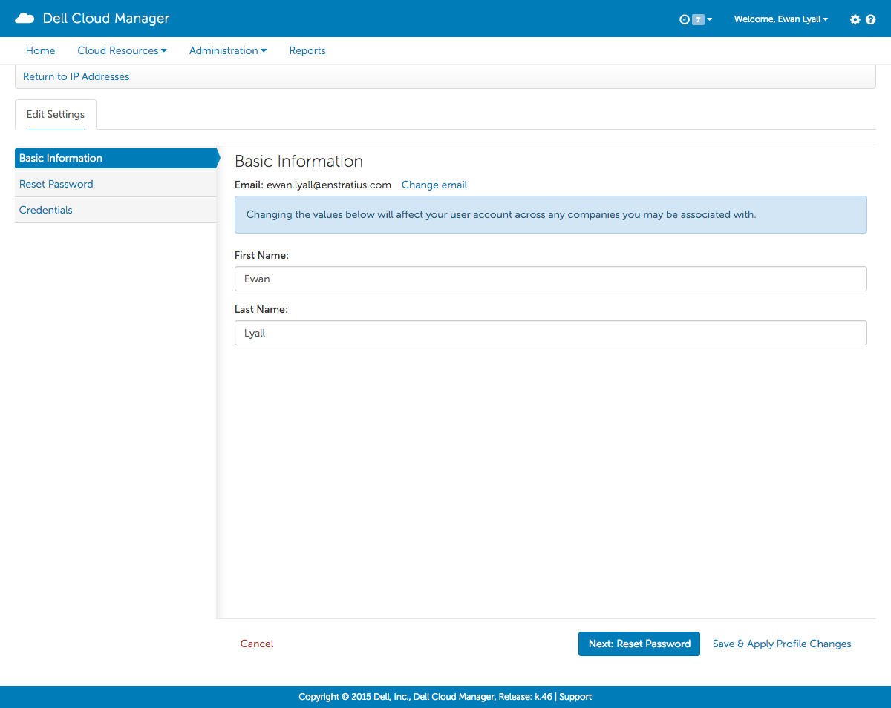

!SLIDE left
# Managing your user account

### **Basic Information**

<table style="width:100%;" cols="03">
<tr>
<td></td>
<td>&nbsp;&nbsp;&nbsp;</td>
<td><h5 style="color:white !IMPORTANT;">
<table style="white-space:nowrap;">
<caption style="text-align:left;"><h4 style="font-size:larger;font-weight:bold;color:white !IMPORTANT;">Basic Information</h4></caption>
<tr><th style="text-align:left;">&nbsp;</th></tr>
<tr><th style="text-align:left;">Email:&nbsp;</th><td>Dell Cloud Manager userid. Cannot be changed.</td></tr>
<tr><th style="text-align:left;">First Name</th></tr>
<tr><th style="text-align:left;">Last Name</th></tr>
</table>
</h5>
</td>
</tr>
</table>