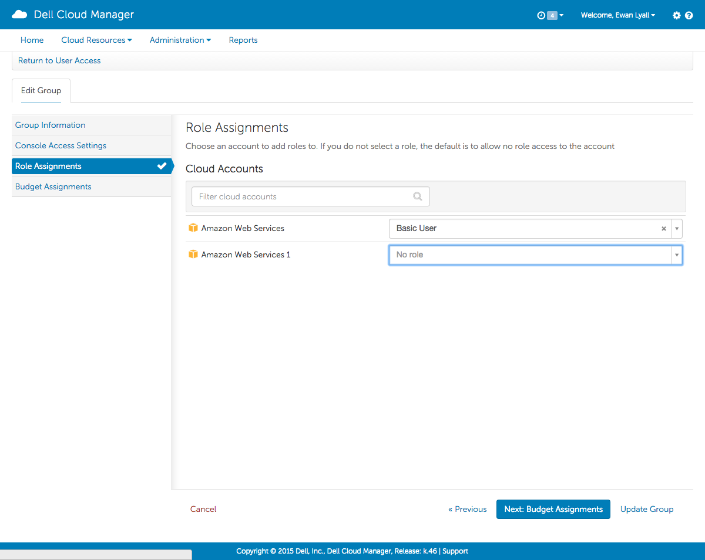

!SLIDE left
# Setting a role for a group

On the **Role Assignments** tab use the dropdowns to select the required role for each cloud account

In this example, all members of this group will be granted the Basic User role for the "Amazon Web Services" account and no role (and therefore no permission) for the "Amazon Web Services 1" account

